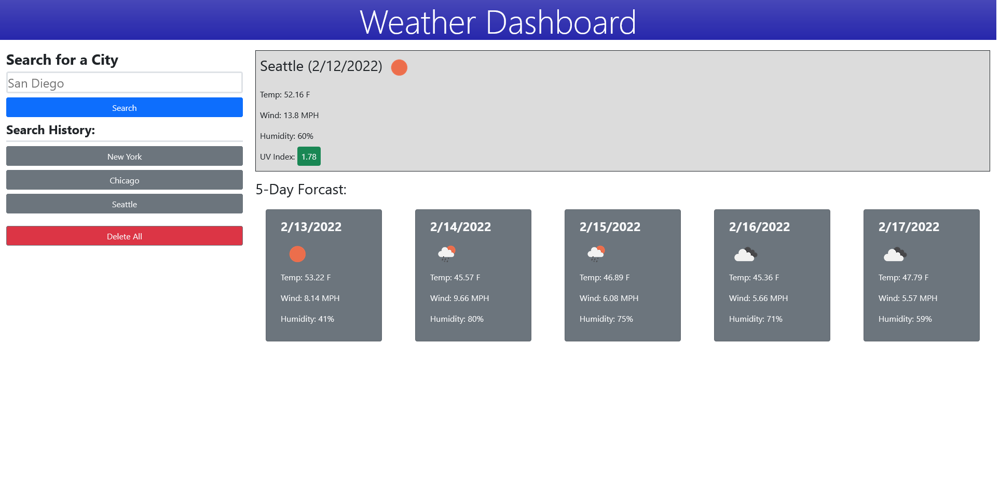

# weather-app

## Purpose
Have a dashboard that allows you to search for and see the current and forcasted weather for a city. 

## Technology Used
HTML, CSS, JavaScript, DayJs, Jquery, Bootstrap

## API's Used
OpenWeather Single Request and OpenWeather Geocoding

## Website
https://sam-clark1.github.io/weather-app/

## Screenshot

## Description
- Allows input of a city you desire to know the weather of.
- When city name submited, displays two things:
    - Current weather which includes city name, current date, icon of current weather, temperature, wind speed, humidity, and UV index.
        - UV index's background color depends on the severity. 
    - 5 Day forcast with each day shown including date, icon representing the weather, temperature, wind speed, and humidity.
- Searchs are then save to local storage and are displayed as buttons that can be clicked to display the weather for that city again.
